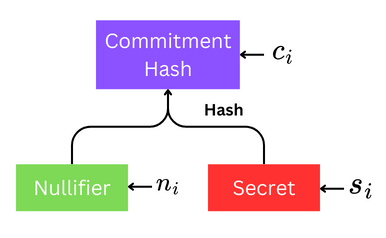
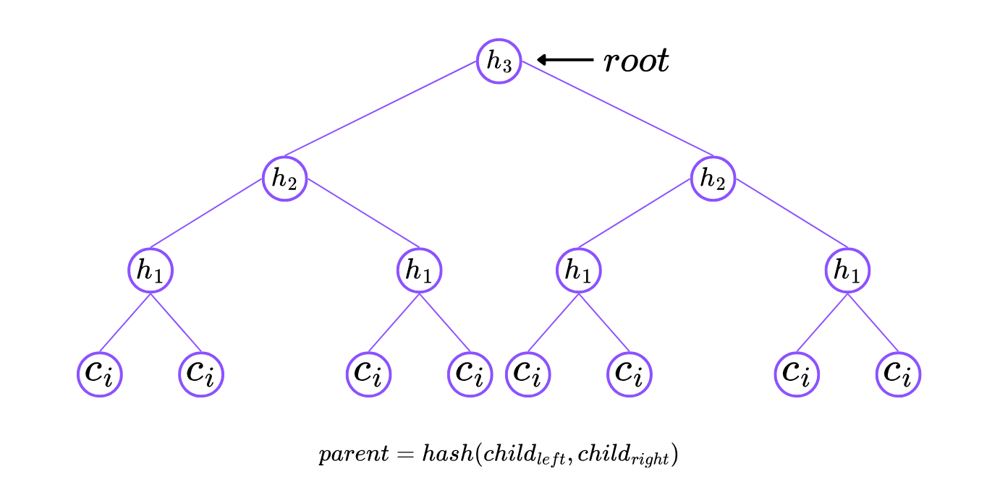
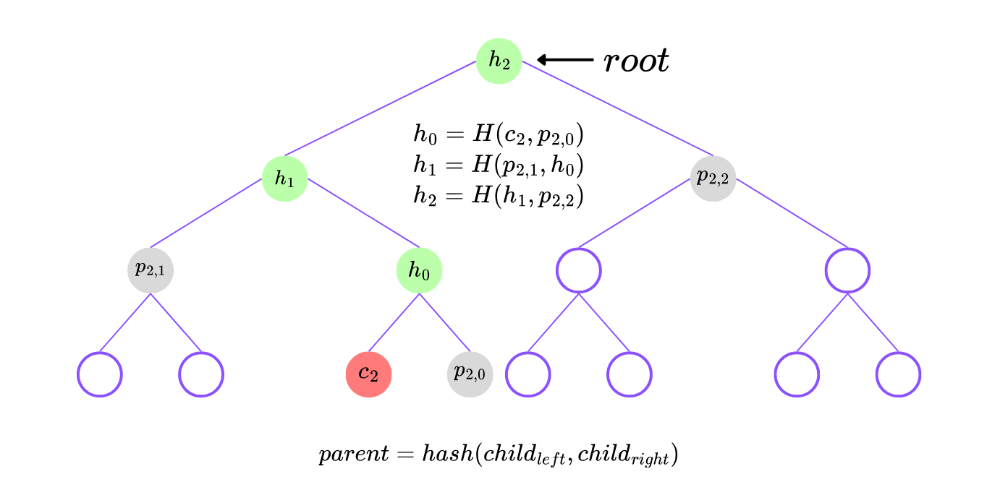

# ZK Incremental Merkle Tree (zk-IMT)

## Introduction

### Incremental Merkle Tree

Incremental Merkle Tree (**IMT**) is a specialized form of a Merkle tree designed to allow for efficient appending of new elements, making it useful in applications where the dataset is expected to grow over time and updates need to be processed efficiently.

### What is zk-IMT?

**zk-IMT** is a zero-knowledge proof system for Incremental Merkle Trees. It allows a prover to prove tree membership and non-membership of a leaf in an IMT without revealing the leaf itself. The prover can also prove the consistency of two IMTs without revealing the entire tree.

## Working

### Generate Commitment Hash

- Generate a random `nullifier` ($n_i$) and `secret` ($s_i$).
- Calculate the hash of them (`commitment`, $c_i = hash(n_i, s_i)$).

<p align="center">  </p>

### Insert Commitment to the Tree

- Insert the `commitment` ($c_i$) to the tree as leaf (onchain).
- After every the path from leaf to root is updated.

<p align="center">  </p>

### Prove that Commitment ($c_i$) is in the Tree

- For a commitment ($c_2$) at index, $i=2$, the path $p_2 = [p_{2,0}, p_{2,1}, p_{2,2}]$
    - Generate $h_2 = H(H(p_{2,1},H(c_2, p_{2,0})),p_{2,2})$
    - Check if $h_2 = root$. If equal then $c_i$ is in the tree.

<p align="center">  </p>

## Requirements

This project was developed and tested with the following software versions:

- Python: 3.11.7
- Node.js: 20.10.0
- Circom Compiler: 2.1.8

## Setup

### Create a virtual environment

```bash
python3 -m venv env
source venv/bin/activate
```

### Install dependencies

```bash
pip install -r requirements.txt
```

### Install SnarkJS

```bash
npm install -g snarkjs@latest
```

## Usage

We will use ZK Incremental Merkle Tree using `app.py` script to perform local and onchain operations.

### Insert New Commitment to the tree

It will generate random `nullifier` and `secret` and insert the hash of the both (`commitment`) to the tree (onchain).

```bash
python app.py --task insert
```

### Prove Membership using zk-SNARK

It will fetch the path of a leaf given it's index and generate a proof for the leaf's membership in the tree. The proof will be verified onchain for tree membership without revealing for which leaf the proof was generated.

```bash
python app.py --task zk-verify
```
